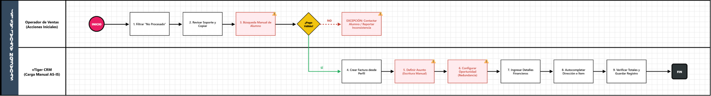
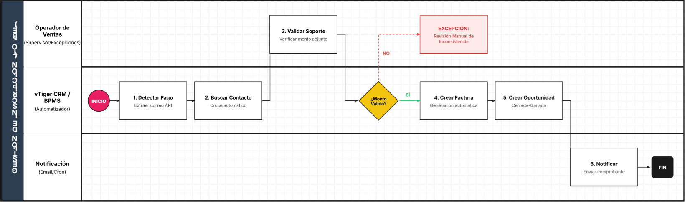

**1. Identificación y Alcance del Proceso**

Esta sección establece el contexto general y los límites del proceso de negocio en su estado actual.

|**Campo**|**Descripción**|**Contenido**|
| :- | :- | :- |
|**Nombre del Proceso**|Gestión y Creación de Facturas por Inscripción (Nuevos Ingresos) |Proceso operativo de facturación comercial. |
|**Objetivo del Proceso**|¿Para qué existe este proceso?|Generar correctamente la factura comercial en el CRM para estudiantes de nuevo ingreso. |
|**Punto de Inicio**|¿Qué evento desencadena el proceso?|Identificación de un registro "No Procesado" en el módulo *Payment Record*. |
|**Punto de Fin**|¿Cuál es el resultado final?|Factura guardada en el sistema con ítems y montos validados. |
|**Documento Fuente**|Documento analizado.|MANUAL 1: Gestión y Creación de Facturas por Inscripción. |

**2. Actores Involucrados (Pools y Carriles / Lanes)**

|**Actor (Lane)**|**Rol en el Proceso**|**Responsabilidades Clave**|
| :- | :- | :- |
|**Operador de Ventas**|Ejecutor|Revisar soportes, buscar contactos y registrar datos financieros. |
|**vTiger CRM**|Sistema / Plataforma|Almacenar registros, vincular oportunidades y procesar facturas. |

**3. Detalle de Actividades y Flujo AS-IS (Secuencia Lógica)**

|**No.**|**Actor (Lane)**|**Tarea / Actividad (Task)**|**Documentos / Sistemas Involucrados**|
| :- | :- | :- | :- |
|1|Operador|Filtrar estados "No Procesado" y concepto "Inscripción".|vTiger (Payment Record) |
|2|Operador|Revisar Soporte de Pago y copiar correo electrónico.|Soporte de Pago adjunto |
|3|Operador|Buscar alumno por correo o cédula.|vTiger (Contactos) |
|4|Operador|Crear nueva Factura desde el perfil del alumno.|vTiger (Lista relacionada) |
|5|Operador|Definir Asunto y seleccionar programa del diplomado.|Formulario de Factura |
|6|Operador|Crear y configurar Oportunidad (Cerrada-Ganada).|vTiger (Módulo Oportunidades) |
|7|Operador|Ingresar detalles financieros (Banco, Fecha, Monto, Referencia).|Voucher de pago |
|8|Operador|Autocompletar dirección y seleccionar ítem del diplomado.|vTiger (Detalles Elemento) |
|9|Operador|Verificar totales y guardar el registro.|vTiger CRM |

**4. Reglas de Negocio y Puertas de Enlace (Gateways)**

**Puerta de Enlace Analizada 1: ¿La información del pago es válida?**

- 🟢 **Camino "SÍ":** Los datos del voucher coinciden con el registro. Se procede a crear la factura. 
- 🔴 **Camino "NO":** Se debe contactar al alumno o reportar inconsistencia (flujo de excepción). 

**Puerta de Enlace Analizada 2: Configuración de la Oportunidad.**

- 🟢 **Regla:** La Fase de Venta **debe** ser "Cerrada-Ganada" para asegurar la correcta ejecución del reporte de ingresos. 

**5. Identificación Inicial de Puntos de Dolor**

- **Búsqueda Manual:** El operador debe copiar y pegar el correo entre módulos manualmente, lo que consume tiempo y genera riesgo de error. 
- **Entrada de Datos Redundante:** El nombre del "Asunto" debe escribirse manualmente tanto en la Factura como en la Oportunidad. 
- **Validación Humana:** El cotejo entre el "Precio de Venta" y el voucher es puramente visual, sin una regla de validación automática en el sistema.

**1. Identificación y Alcance del Proceso (TO-BE)**

Esta sección define el estado futuro y mejorado del flujo de facturación, priorizando la agilidad y la trazabilidad total. 

|**Campo**|**Descripción**|**Contenido**|
| :- | :- | :- |
|**Nombre del Proceso**|Gestión Automatizada de Facturación y Oportunidades|Proceso optimizado de ingresos. |
|**Objetivo del Proceso**|¿Qué valor aporta la mejora?|Reducir el tiempo de ciclo de facturación y eliminar errores de digitación mediante la sincronización automática de datos entre el pago y la factura. |
|**Punto de Inicio**|¿Qué dispara el proceso?|Registro de un nuevo pago en el módulo *Payment Record* vía API o entrada manual. |
|**Punto de Fin**|¿Cuál es el resultado final?|Factura generada, Oportunidad cerrada y notificación automática al estudiante. |
|**Documento Fuente**|Base del análisis.|Análisis AS-IS: Gestión y Creación de Facturas por Inscripción. |

-----
**2. Actores Involucrados (Lanes)**

En este modelo, el sistema asume un rol activo para realizar tareas que antes eran manuales. 

- **Operador de Ventas (Iniciador/Supervisor):** Responsable de validar casos de excepción y supervisar la integridad de los datos financieros. 
- **Sistema BPMS / vTiger (Automatizador):** Enruta tareas, realiza búsquedas automáticas en la base de datos y genera registros vinculados sin intervención humana. 
- **Servicio de Notificación (Email/Cron):** Informa al cliente y al equipo interno sobre el estado de la transacción. 
-----
**3. Detalle de Actividades y Flujo TO-BE**

Se diferencia entre tareas de usuario (**User Task**) y tareas automáticas del sistema (**Service Task**). 

|**No.**|**Actor**|**Tarea / Actividad**|**Tipo de Tarea (BPMN)**|
| :- | :- | :- | :- |
|1|**vTiger CRM**|Detectar nuevo registro de pago y extraer correo electrónico.|Service Task |
|2|**vTiger CRM**|Buscar contacto coincidente por correo o ID automáticamente.|Service Task |
|3|**Operador**|Validar que el soporte adjunto coincida con el monto registrado.|User Task |
|4|**vTiger CRM**|Crear Factura vinculada al contacto con datos del programa.|Service Task |
|5|**vTiger CRM**|Crear Oportunidad "Cerrada-Ganada" heredando datos de la factura.|Service Task |
|6|**Sistema**|¿Validación exitosa? (Puerta de enlace lógica).|Gateway Exclusive |
|7|**Servicio Email**|Enviar comprobante de factura al correo del alumno.|Service Task |

-----
**4. Reglas de Negocio y Puertas de Enlace (Gateways)**

**Puerta de Enlace 1: ¿Conciliación de Montos Exitosa?**

- 🟢 **Camino "SÍ" (Flujo de Continuidad):**
  - **Criterio:** El monto del voucher cargado coincide con el valor del ítem seleccionado. 
  - **Resultado:** El sistema genera la factura y cierra la oportunidad automáticamente. 
- 🔴 **Camino "NO" (Flujo de Excepción):**
  - **Criterio:** Discrepancia entre el pago reportado y el valor del programa. 
  - **Resultado:** Se crea una tarea de "Revisión Manual" para el Operador y se detiene el flujo de facturación. 
-----
**5. Beneficios y Mejoras Implementadas (Justificación)**

- **Eliminación de Búsqueda Manual:** El sistema realiza el cruce de correos electrónicos automáticamente, eliminando el riesgo de asociar facturas a contactos incorrectos. 
- **Integración de Datos:** Se erradica la redundancia; el "Asunto" y los detalles financieros se completan una sola vez y se propagan a la Factura y Oportunidad. 
- **Trazabilidad:** El solicitante (alumno) recibe una confirmación inmediata, y el proceso queda registrado con sellos de tiempo exactos en el BPMS. 

